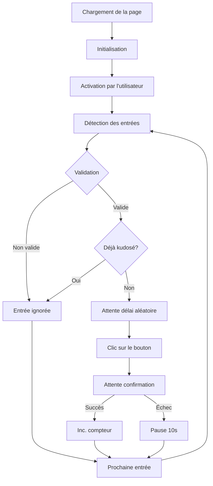

# Strava Auto Kudos

Extension Chrome pour donner automatiquement des kudos aux activités de vos amis sur Strava.

## Fonctionnalités

- Donne automatiquement des kudos aux activités
- Compteur de kudos dans la bulle de l'extension
- Délais aléatoires entre les kudos
- Gestion intelligente des erreurs
- Interface simple et intuitive

## Installation

1. Téléchargez le fichier ZIP de l'extension
2. Décompressez le fichier
3. Ouvrez Chrome et allez dans `chrome://extensions/`
4. Activez le "Mode développeur"
5. Cliquez sur "Charger l'extension non empaquetée"
6. Sélectionnez le dossier décompressé

## Utilisation

1. Allez sur votre flux d'activités Strava
2. Cliquez sur l'icône de l'extension pour l'activer
3. L'extension donnera automatiquement des kudos aux nouvelles activités
4. Le compteur dans la bulle indique le nombre de kudos donnés

## Flux de traitement

### Description du flux

1. **Initialisation**
   - Chargement de la page Strava
   - Initialisation des managers nécessaires
   - Configuration des observateurs

2. **Activation**
   - Attente de l'activation par l'utilisateur
   - Démarrage du traitement des entrées

3. **Détection et validation**
   - Observation du flux d'activités
   - Validation des entrées :
     - Structure de l'entrée
     - Attributs requis
     - Âge de l'entrée (max 7 jours)
     - Bouton kudos valide

4. **Traitement des kudos**
   - Si l'entrée est valide :
     - Attente d'un délai aléatoire
     - Clic sur le bouton kudos
     - Attente de la confirmation
     - Incrémentation du compteur

5. **Gestion des erreurs**
   - Erreurs réseau : pause de 10 secondes
   - Erreurs Strava : pause de 30 secondes
   - Reprise automatique après la pause

### Points clés

- **Validation stricte** : Chaque entrée est validée avant traitement
- **Gestion des erreurs** : Système de pause intelligent
- **Interface** : Compteur de kudos en temps réel
- **Résilience** : Reprise automatique après les erreurs

## Configuration

L'extension utilise des paramètres par défaut optimisés :
- Délais aléatoires entre les kudos
- Âge maximum des entrées : 7 jours
- Timeout de confirmation : 5 secondes

## Sécurité

- Vérification systématique des kudos déjà donnés
- Délais aléatoires pour éviter la détection
- Pas de stockage de données sensibles

## Support

Pour toute question ou problème, n'hésitez pas à ouvrir une issue sur GitHub.
